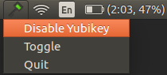
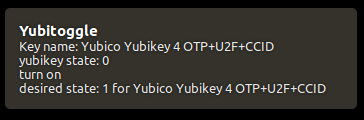

yubitoggle-applet
================

Requires [yubitoggle](https://github.com/djcp/yubitoggle) to already be in your
path.

yubitoggle-applet adds an app icon in your taskbar to quickly check the status
and toggle your yubikey on/off. Tested on Ubuntu but should work on other Linux OS too.

The icons are shamelessly stolen from
[Yubiswitch](https://github.com/pallotron/yubiswitch).

## Screenshots

## Reference
The guide was super helpful in creating the applet:
http://candidtim.github.io/appindicator/2014/09/13/ubuntu-appindicator-step-by-step.html

## Improvements still to do

 - Add yubitoggle directly so users don't need to manually add it to path
 - Add install script to run on startup
 - Handle missing gtk dependencies
